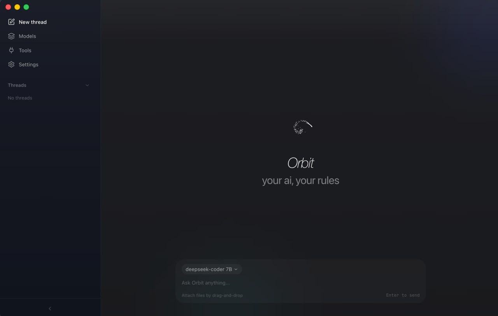
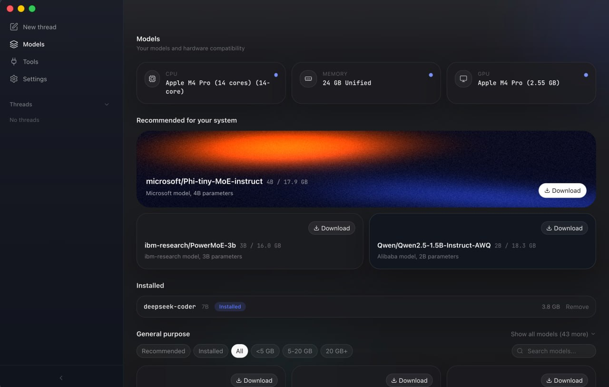

<h1 align="center">Orbit</h1>

<p align="center">
  <strong>your ai, your rules.</strong>
</p>

<p align="center">
  local AI that scans your hardware, recommends the best models,<br/>
  and runs them privately on your machine.
</p>

<p align="center">
  
  
  
  
</p>

---

<p align="center">
  
</p>

<p align="center">
  
</p>

---

## what it does

- **scans your hardware** — detects CPU, GPU, VRAM, and tells you exactly which models your machine can handle
- **one-click model management** — browse, download, switch between models. no terminal required
- **threaded conversations** — branch any message into a side thread without losing context
- **fully private** — everything runs locally through Ollama. nothing leaves your device. no accounts, no telemetry

---

## getting started

requires macOS (Apple Silicon recommended), [Ollama](https://ollama.com), and Node.js 18+.

```bash
git clone https://github.com/savka777/orbit.git
cd orbit/orbit
npm install
npm run dev:electron
```

to build a `.dmg`:

```bash
npm run build:electron
```

---

## roadmap

**now**
- hardware detection + model recommendations
- one-click model download and management
- streaming chat with local models
- multi-conversation support
- threaded conversations

**next**
- [TurboQuant](https://arxiv.org/abs/2504.19874) integration — 6x KV cache compression, same hardware runs bigger models
- MCP tool support — connect your AI to files, browser, calendar, code execution
- uncensored model support — Dolphin and other unfiltered models
- real-time performance dashboard — tok/s, VRAM, temperature

**later**
- workspaces — different models, tools, and system prompts per context
- plugin marketplace for community MCP tools
- Windows and Linux
- local LoRA fine-tuning

---

## research

we're integrating cutting-edge inference research directly into Orbit.

**TurboQuant** (Google Research, 2026) compresses the KV cache from 16-bit to 3-bit with zero quality loss. community ports to Apple Silicon MLX already show 42% memory reduction with perfect coherence. we're building this into Orbit's inference layer.

papers:
- [TurboQuant: Extreme KV Cache Compression](https://arxiv.org/abs/2504.19874)
- [PolarQuant](https://arxiv.org/pdf/2502.02617)
- [QJL: 1-bit Johnson-Lindenstrauss](https://arxiv.org/abs/2406.03482)

---

## stack

| | |
|---|---|
| runtime | Electron |
| frontend | React, TypeScript, Tailwind v4 |
| animation | Framer Motion, GSAP, Three.js |
| inference | Ollama |
| hardware | custom `llmfit` binary |
| build | Vite, electron-builder |

---

## contributing

```bash
cd orbit/orbit
npm run dev              # vite dev server
npm run dev:electron     # electron + vite
npm run build            # production build
npm run lint             # eslint
```

areas that need help:
- TurboQuant integration (PolarQuant + QJL in the inference layer)
- MCP client in Electron main process
- cross-platform testing (Windows, Linux)
- model format compatibility

fork it, branch it, PR it.

---

## mission

AI is becoming essential infrastructure. using it shouldn't mean sending your thoughts to someone else's server and paying monthly for the privilege.

Orbit runs on your hardware, under your control, with your choice of model. no filters you didn't ask for. no subscription. no data you can't delete.

your ai, your rules.

---

<p align="center">
  built by <a href="https://x.com/savboj">@savboj</a>
</p>
